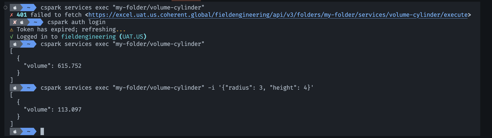

# Coherent Spark CLI

Coherent Spark CLI (currently in **beta**) is a command-line interface that lets
developers interact with the Coherent Spark platform. It is built on top of the
[SDK] and allows you to perform basic operations such as authenticating to Spark,
listing available services, and executing Spark services.

This CLI is designed for developers who want to interact with the platform in a
more programmatic way, without having to write code.

## Installation

Using [Homebrew](https://brew.sh/):

```bash
brew tap Coherent-Partners/cspark
brew install cspark
```

Using [pip](https://pypi.org/project/cspark/) (`Python 3.8+` required):

```bash
pip install 'cspark[cli]'
```

> We recommend installing the CLI in a virtual or isolated environment when using pip.

## Usage

```bash
$ cspark -v
Coherent Spark CLI 0.1.0-beta (sdk v0.1.10)
```

Coherent Spark CLI provides the following basic commands:

- `init`: Initialize a new Spark configuration profile.
- `config`: Manage Coherent Spark configuration profiles.
- `auth`: Authenticate with Spark using OAuth2 client credentials.
- `folders`: Manage Spark folders.
- `services`: Manage Spark services.
- `versions`: Interact with versions of a Spark service.

For example, run the following command to execute a Spark service:

```bash
cspark services execute "my-folder/my-service" --inputs '{"value": 42}'
```

This command relies on the Spark settings and authentication of an active profile
to build the request and execute the service. Run `cspark config --help` to learn
how to manage your profiles.

[](flow.png)

<!-- References -->
[sdk]:https://pypi.org/project/cspark/
