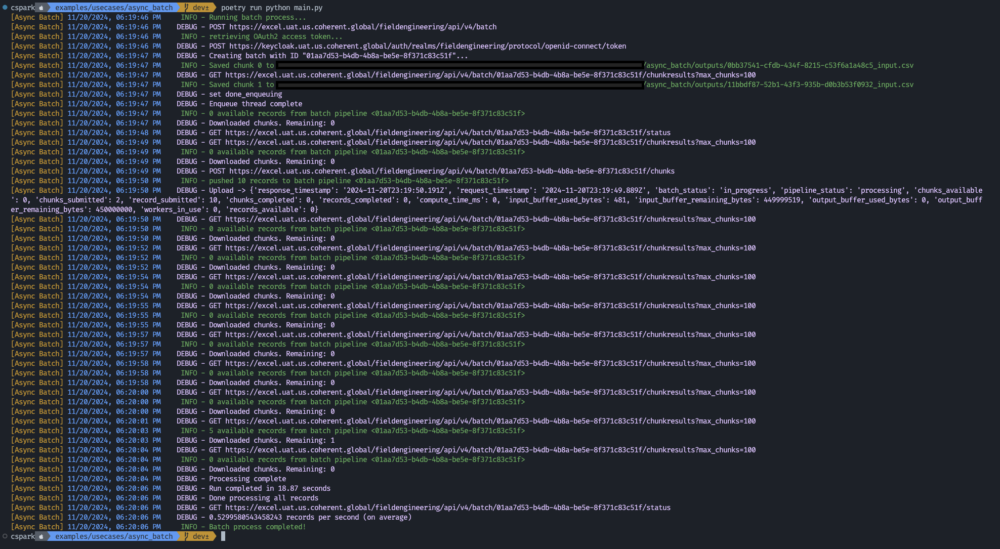

## Asynchronous Batch Processing

This example serves as a starting point for developers to create batch jobs using
the [SDK][sdk]. It provides a basic structure and configuration setup to quickly
get started with batch processing tasks.

## Setup

Create or edit your `.env` file (e.g., [.env.local](../../../.env.local)) in the
project root folder and add your Spark environment URL and API authentication details:

```bash
CSPARK_BASE_URL="https://spark.my-env.coherent.global/my-tenant"
CSPARK_API_KEY="my-api-key"
```

These environment variables are used by the SDK to authenticate and connect to
your Spark environment.

## Configuration

Batch inputs and options are specified in [`config.py`](helpers/config.py). Modify
this file to adjust your batch processing settings, including:

- Input CSV file location
- Chunk size
- Number of chunks
- Service URI

## Usage

1. Update the `config.py` file with your desired batch settings and input CSV file location.
2. Run the main script:

```bash
poetry run python main.py
```

The script will read the input CSV file, split it into chunks, and process each
chunk asynchronously. The batch processing status is displayed in the console as
each chunk is being processed.

[](outputs.png)

## Customization

Modify the [`main.py`](main.py) file to add your own post-processing logic after
the batch processing is complete. You can also add error handling, logging, and
other customizations to suit your specific use case.

<!-- References -->
[sdk]: https://github.com/Coherent-Partners/spark-python-sdk
