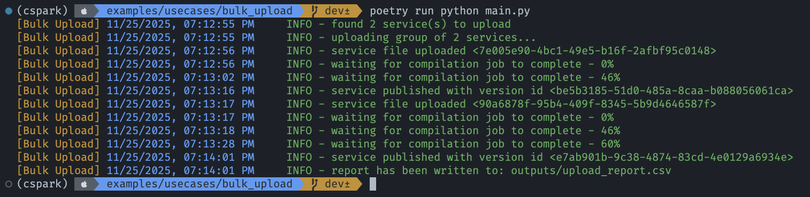

## Bulk upload services to Spark

This example demonstrates how to bulk upload multiple Spark services in parallel using the SDK.
It reads a YAML/JSON configuration, validates it against `schema.json`, discovers and filters
service files, groups uploads by `bulk_size`, performs asynchronous uploads, and writes both
per-service JSON responses and an aggregated CSV report.

## Setup and Testing

1. Create a `.env` file with your Spark environment credentials (base URL, tenant, and token).
2. Review and update `config.yml` as needed (see Configuration below).
3. Run the example:

```bash
poetry run python main.py
```

When the run completes:

- Per-service upload responses are written to `outputs/*.json`.
- A summary CSV report is written to `outputs/upload_report.csv`.
- Console logs are written to `console.log`.

## Configuration

The upload behavior is driven by `config.yml` and validated with `schema.json`. A minimal
sample looks like:

```yaml
version: 1.0
logging: DEBUG

outdir: outputs/
allowed_formats: ['.xlsx', '.xls']
max_file_size_mb: 25
bulk_size: 2

upload:
  folder: my-folder
  versioning: patch
  max_retries: 20
  retry_interval: 4.0

services:
  - path/to/your/file.xlsx
  - path/to/your/other/file.xlsx

```

- `version`: must be `1.*` (enforced).
- `logging`: one of `DEBUG|INFO|WARNING|ERROR|CRITICAL`.
- `outdir`: directory where JSON responses and the CSV report are written.
- `allowed_formats`: permitted file extensions for service files.
- `max_file_size_mb`: maximum upload file size (MB); over-limit files are skipped.
- `bulk_size`: number of services uploaded concurrently per group.
- `upload`: defaults applied to all services.
  - `folder`: required; must already exist in the tenant.
  - `versioning`: one of `patch|minor|major`.
  - `max_retries`, `retry_interval`, `start_date`, `end_date`: optional controls.
- `services`: either a list of file paths (the file stem becomes the service name), or a list of objects
  with per-service overrides (see below).

> [!TIP]
> Configuration can be provided as a JSON file too (e.g., `config.json`).

### Per-service overrides

You can override `upload` options per service:

```yaml
services:
  - name: premium-pricing
    file: path/to/Premium-Pricing-Final.xlsx
    using:
      folder: premium
      versioning: minor
      start_date: '2025-01-01'
      end_date: '2025-12-31'
      track_user: true
      max_retries: 10
      retry_interval: 5.0
```

## Outputs

- JSON responses: `outputs/<service-name>.json` (raw SDK responses).
- CSV report: `outputs/upload_report.csv` with columns:
  - `file_name`, `folder`, `service`, `success`, `processed_at`
- Logs: `console.log`

[](outputs.png)

## Notes

- The configuration is validated against `schema.json` at runtime; invalid configs will abort with errors.
- Files with unsupported extensions, missing folders, or exceeding size limits are skipped with warnings.
- Feel free to use this [httpx.AsyncClient](https://www.python-httpx.org/async/) to add extra capabilities
  (proxy, auth, timeout, SSL verification, etc).

<!-- References -->
